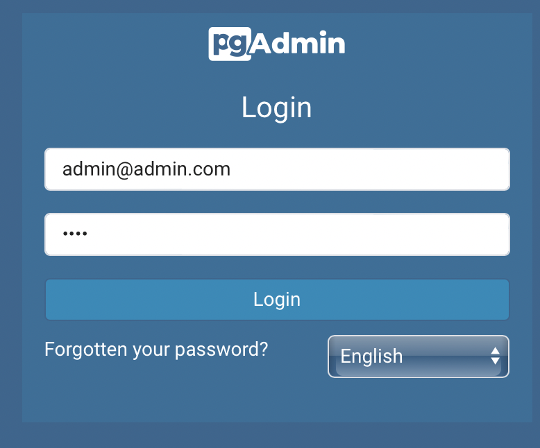
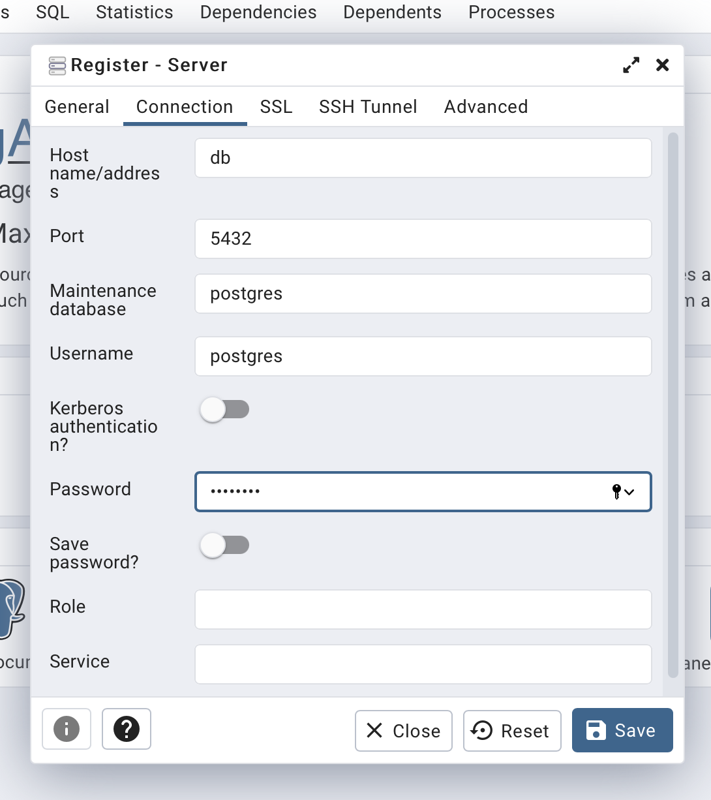
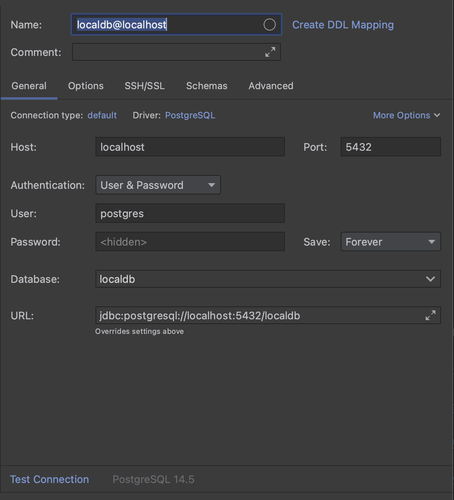

# Tec Energy Home Project


[](https://opensource.org/licenses/MIT)

## Idea

Download a CSV file from a Website and save it in a database (PostgresSQL).

## ⚡️ Quick start

First, [download](https://www.docker.com) and install docker.

It is recommended to install docker to use the docker compose for all local dependencies.

## 🐳 Running

[//]: # (This solution rely on docker compose to up our PostgresSQL instance, to run the migration )

Type on the root of this repository:

```shell
docker compose up --build
```

That's is it! It will up our PostgresSQL instance, run the migration and start the application.

## 📁 Project structure

    .
    ├── flyway                   # Tool to perform migrations
    │   └── sql                  # Sql migrations
    │    └──  V1__Initial.sql    # DDL that performs the create table
    ├── DownloadCsvOverHttp      # .NET Console Application (Open this in your IDE if you wanna code)
    │   ├── models               # Models and Enums
    │   ├── repository           # Request to DB and Insertion Query
    │   ├── services             # Service to Download the csv
    │   ├── DockerFile           # File to create our .NET container
    │   └── Program.cs           # Web App to call others services
    ├── .env                     # Environment variables
    └── docker-compose.yml       # Setup the local infrastructure


## Connecting to Database

You can either use the locally adminer or another App.


### Locally:

- After [running](#running) go to http://localhost:5050/

```text
Email: admin@admin.com
Password: root
```



- And for connecting **inside** the container:

```text
Host: db
Port: 5432
UserName: postgres
Password: postgres
```



### Using another tool:

For connections outside the container, use this:

```text
Host: localhost
Port: 5432
UserName: postgres
Password: postgres
Database: localdb
```




## Insertion Query

The query performed inside the app is:

```postgresql
INSERT INTO public.operationallyavailablecapacitytw(id, loc, loc_zn, loc_name, loc_purp_desc, loc_qti, flow_ind, dc, opc, tsq, oac, it, auth_overrun_ind, nom_cap_exceed_ind, all_qty_avail, qty_reason)
VALUES (?, ?, ?, ?, ?, ?, ?, ?, ?, ?, ?, ?, ?, ?, ?, ?);
```


## License
[MIT](https://choosealicense.com/licenses/mit/)
